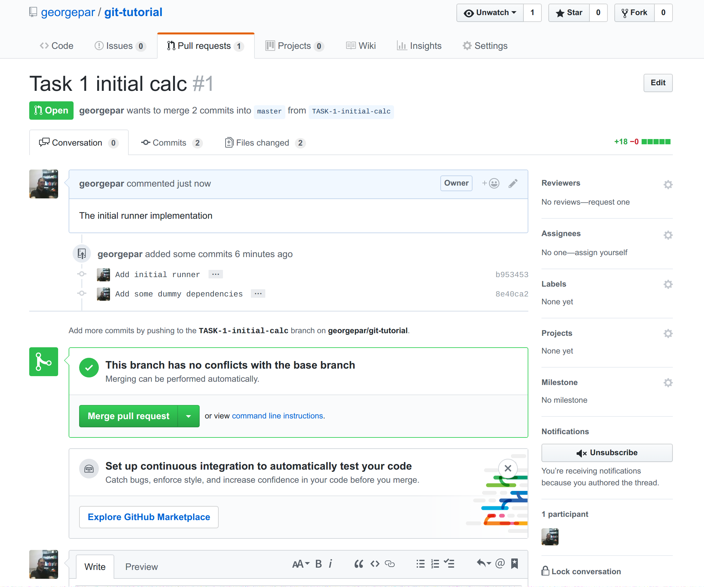

# git-tutorial
A repo to demonstrate the git workflow 

## Introduction

In this tutorial we are going to demonstrate one simple git workflow that can be used in moderately large projects from software dev teams (for large projects I still advocate [gerrit](https://www.gerritcodereview.com/)).

The working example will be the implementation of a toy calculator in Python.

More concretely we are going to demonstrate:  
1. Branching, Creating and merging a PR  
2. Rebasing and Merge conflict resolution  
3. Commit squashing  

## Part 1: Branching out  

In large projects direct push to master is a bad idea. Everybody knows that, even the [stackexchange people](https://softwareengineering.stackexchange.com/a/335682) :).

So everyone should incorporate branching in their dev workflow. In most cases you will create a new branch for every issue in your issue tracker. Let's see how this is done in practice:  

```
git clone https://github.com/georgepar/git-tutorial
git checkout -b TASK-1-initial-calc
# Edit run.py
git add run.py
git commit -sv -m "Add initial runner"
# Edit requirements.txt
git add requirements.txt
git commit -sv -m "Add some dummy dependencies"
git push -u origin TASK-1-initial-calc
```

Now we developed an initial version of our calculator in a new branch. 

- `run.py`
```python
import sys


def main():
    # The operation we want to perform will be passed
    # as a string in the positional command line args
    # Example: python run.py '1 + 2'
    args = sys.argv[1].strip().split()
    x, op, y = args[0], args[1], args[2]
    print(x, op, y)


if __name__ == '__main__':
    main()
```
- `requirements.txt`
```
numpy==1.7.1
requests==2.7.0
```

We can go into our VCS UI (in this case github) and create a pull request. When this PR passes the CI tests and the reviews it can be merged from the UI.



## Part 2: Rebasing

### Case 1: Two independent devs develop different features

In this case let's assume that we have 2 tasks, TASK-2-implement-addition and TASK-3-implement-multiplication.
We assign them to Alice and Bob respectively and they start developing independently.

Alice finishes first and her PR gets merged. The new code is shown below:

```python
import sys


def add(x, y):
    return x + y


def main():
    # The operation we want to perform will be passed
    # as a string in the positional command line args
    # Example: python run.py '1 + 2'
    args = sys.argv[1].strip().split()
    x, op, y = args[0], args[1], args[2]

    if op == '+':
        return add(x, y)
        

if __name__ == '__main__':
    main()
```

Alice also updated the dependency versions in `requirements.txt`:

```
numpy==1.13.3
requests==2.18.4
```
